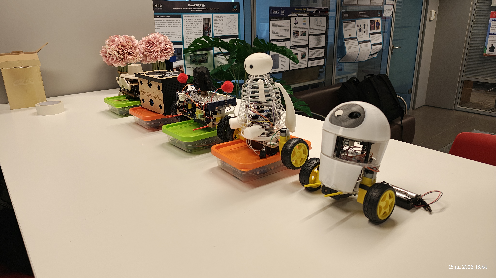

# Proyectos Semestrales
## Curso ME4250 Mecatrónica - Semestre 2026-1

Este directorio consolida los desarrollos técnicos de los grupos de trabajo del semestre. El objetivo principal de este periodo académico fue el diseño, construcción y control de robots autobalancines.

<p align="center">
  
</p>

## Contenido General de los Proyectos

Cada carpeta de proyecto almacenada en este repositorio contiene, de manera estandarizada, los siguientes recursos técnicos necesarios para la replicación y evaluación de los prototipos:

* **Modelos CAD:** Archivos de diseño mecánico y ensamblaje.
* **Electrónica:** Diagramas esquemáticos y de conexión.
* **Firmware:** Códigos fuente y librerías utilizadas.
* **Listas de Materiales (BOM):** Detalle de componentes y presupuesto.
* **Registro Audiovisual:** Evidencia del funcionamiento y validación del sistema.

## Estructura de Directorios

```text
📂 Repositorios/
├── Baymax_Balanc-n
├── Equili-beat-
├── Jesus-Robot-Autobalancin-del-Futuro
├── Proyecto-Mecatronica-EVA
└── Sir-Balance-III

```

## Equipos de Trabajo

A continuación se detalla la conformación de los grupos y la denominación asignada a sus respectivos robots:

| Nombre del Proyecto / Robot | Integrantes del Grupo |
| --- | --- |
| **Equili-beat** | Antonia Muñoz, María Jesus Caldera, Benjamín Olivares, Benjamín Bou |
| **Jesus-Robot-Autobalancin-del-Futuro** | Esteban Ortiz, Millaray González, Valentina Gómez, Vicente Leiva |
| **EVA** | Agustín Ketterer, Katalyna Tapia, Isabella Silva, Joaquín Zuñiga |
| **Sir-Balance-III** | Benjamín Castillo, Ignacio Saavedra, Jorge Brahim, Pedro Gómez|
| **Baymax** | Ignacio Montero, Ignacio Sanhueza, Matías Yanine, Rodrigo Pino|


---

**Departamento de Ingeniería Mecánica | Universidad de Chile**
