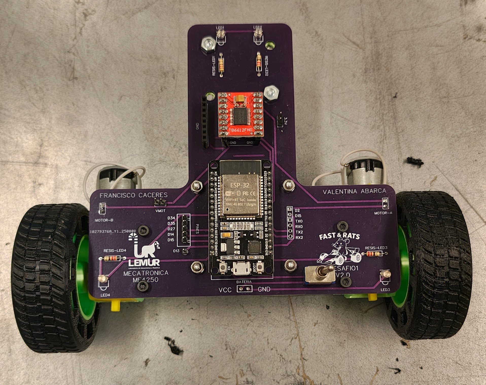
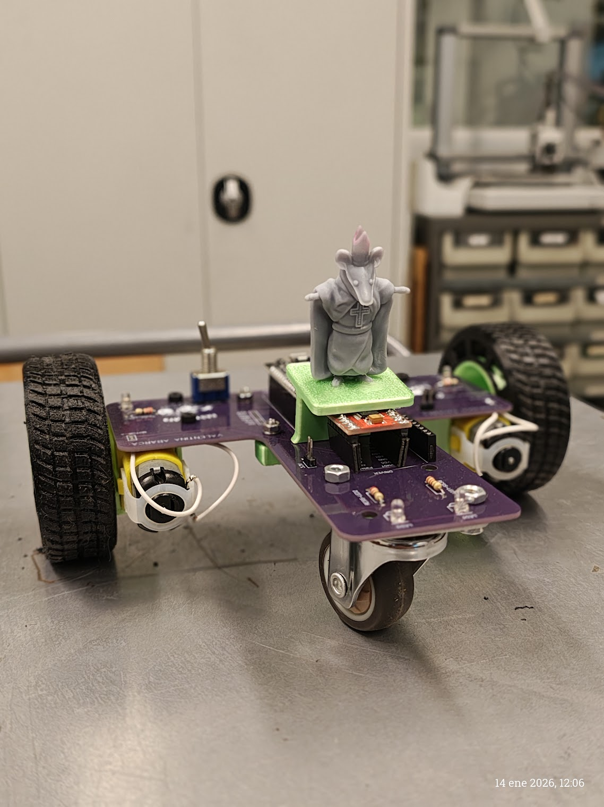
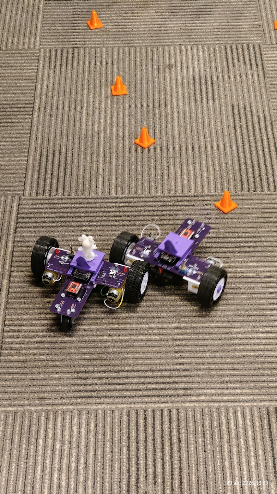
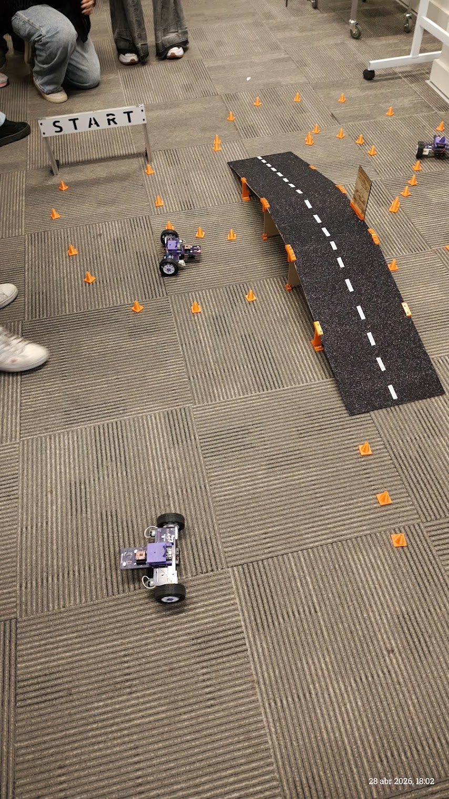

# 📷 Multimedia - El Ratmóvil
## ME4250 - Mecatrónica | Subcarpeta Multimedia

Esta carpeta contiene el registro visual y los recursos gráficos del proyecto. Se ha organizado para facilitar la consulta del proceso de fabricación, las pruebas de funcionamiento y la identidad visual del equipo.

---

## 🖼️ Galería de Fotos

Aquí se presenta una recopilación visual del proceso de desarrollo y del Ratmóvil terminado.

* [📂 Ir a la carpeta de Fotos](Fotos/)

<table align="center">
  <tr>
    <td align="center">
      
       Vista Superior Ratmovil
    </td>
    <td align="center">
      
       Vista Ortogonal Ratmovil
    </td>
  </tr>
  <tr>
    <td align="center">
      
       RatMoviles
    </td>
    <td align="center">
      
       Pruebas en pista
    </td>
  </tr>
</table>

---

## 🎥 Videos
En esta subcarpeta se encuentran los registros audiovisuales de las pruebas de movimiento y rutinas preestablecidas:
* [📂 Ir a la carpeta de Videos](Videos/)

---

## 🎨 Logos y Recursos Gráficos
Contiene la identidad visual utilizada para la personalización del Ratmóvil y materiales de presentación:
* [📂 Ir a la carpeta de Logos](Logos/)

---

[⬅️ Volver al README Principal del Desafío 1](../README.md)