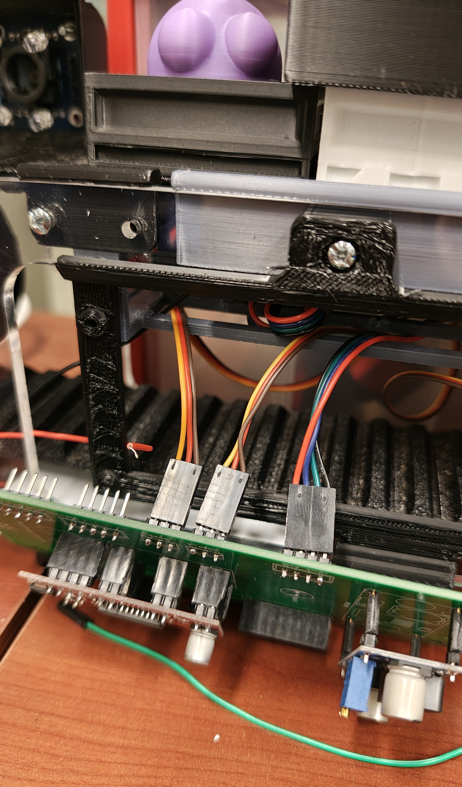
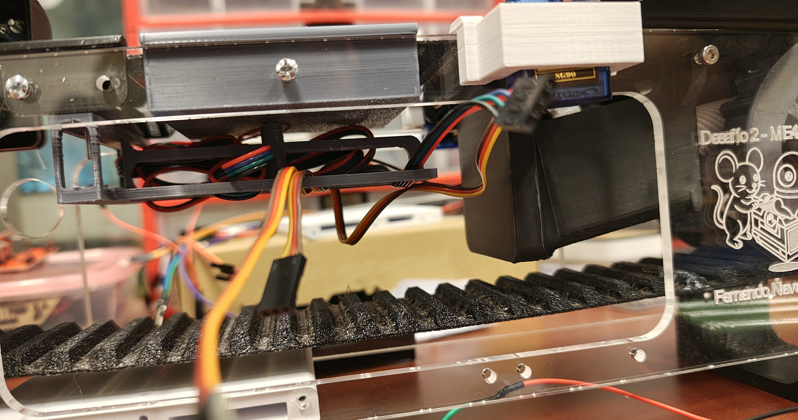

# 🏗️ Desafío 2: R.A.T Industries - Versión V2
## ME4250 - Mecatrónica | Semestre 2026-1

  

<table align="center">
  <tr>
    <td align="center" width="50%">
      
       <i>Vista Frontal</i>
    </td>
    <td align="center" width="50%">
      
       <i>Vista Superior</i>
    </td>
  </tr>
  <tr>
    <td align="center" width="50%">
      
       <i>Integración de PCB:</i>
    </td>
    <td align="center" width="50%">
      
       <i>Manejo de Cables</i>
    </td>
  </tr>
</table>

Este repositorio contiene la documentación y los archivos fuente correspondientes al segundo desafío del curso. El objetivo principal es el codiseño, fabricación por corte láser/impresión 3D y la automatización de una **Correa Transportadora Clasificadora de Materiales por Color**, controlada mediante un microcontrolador Arduino.

El sistema procesa objetos físicos dentro de una cámara de aislamiento lumínico utilizando un sensor óptico RGB, mapea las lecturas en tiempo real y acciona actuadores electromecánicos simétricos para derivar los elementos hacia tres bahías de descarga independientes.

---
### ⚠️ Este es un respaldo de la última versión (2026)

**Idea y Desarrollo Original:** [Fernando Navarrete](https://github.com/FernandoN23/Conveyor-Belt-Arduino-DIY) (link al repositorio original con todas las versiones y cambios)

---

## 📂 Estructura del Proyecto y Documentación

El proyecto está modularizado por áreas de ingeniería. Para revisar las instrucciones de montaje, el funcionamiento del código o el detalle de los circuitos, **por favor consulta el archivo `README.md` al interior de cada subcarpeta:**

* 📐 [**`CAD/`**](CAD/README.md) - Modelos 3D en Fusion 360 y formato .STEP del chasis de acrílico estructural, piezas estructurales y componentes electrónicos anclados.
* 💻 [**`Código/`**](Código/README.md) - Firmware modularizado en C++ (`.ino`) con algoritmos de calibración y control de la correa transportadora y el sistema de clasificación.
* 📄 [**`Documentos/`**](Documentos/README.md) - Documentación formal del desafío.
* ⚡ [**`Electrónica/`**](Electrónica/README.md) - Diseño de la PCB en EasyEDA, ruteo de pistas de potencia, capacitores de desacoplo y esquemáticos.
* 📷 [**`Multimedia/`**](Multimedia/Multimedia/README.md) - Fotografías de la correa y videos demostrativos del funcionamiento dinámico.

---
## 📋 Lista de Materiales (BOM)

Para la construcción de este proyecto, se utilizaron los siguientes componentes:

* **Microcontrolador:** 1x Arduino (Uno / Nano).
* **Control de Potencia:** 1x Driver de motor paso a paso EasyDriver A3967.
* **Regulación de Energía:** 1x Convertidor Buck DC-DC Step-Down LM2596.
* **Estabilización:** 1x Condensador Electrolítico de 470µF.
* **Sensores:** 1x Sensor de Color GY-31 / TCS3200.
* **Actuadores:** 1x Motor Paso a Paso NEMA 17 + 2x Servomotores SG90.
* **Alimentación:** 3x Baterías Ion-Litio 18650 + 1x Portapilas triple.
* **Control de Energía:** 1x Switch (interruptor) SPST (2 pines).
* **Apoyo Mecánico:** 4x Rodamientos 627zz + 4x Imanes de Neodimio 12x4mm.
* **Fijaciones:** Pernos de cabeza cilíndrica ISO M3x8 y M4x8.
* **Integración:** 1x PCB personalizada (Desafío 2) + Pin Headers (2.54mm).

---
## 📊 Criterios de Evaluación

- [x] **Diagrama Esquemático:** Entregan un diagrama esquemático de la arquitectura del Desafío 2. Se debe entregar en el reporte. (1 pto)
- [x] **Código Comentado:** Código utilizado y bien comentado en el Desafío 2. Adjuntar al reporte para revisión. (1 pto)
- [x] **Funciones Sensores y Actuadores:** Implementar funciones esenciales que permiten el accionamiento de los motores y la lectura del sensor de color. (1 pto)
- [x] **Rutina de Clasificación / Circuito:** Completa satisfactoriamente la clasificación mediante una rutina preestablecida. (2 ptos)
- [x] **Propuestas de Mejora:** Mejoras u observaciones del desafío 2 en relación a su dificultad, metodología o aprendizajes. Se debe entregar en el reporte. (1 pto)

---

## 👨‍💻 Créditos y Evolución del Proyecto

Este desarrollo escolar se basa fuertemente en el ecosistema abierto del autor, rescatando aprendizajes de iteraciones pasadas y consolidando las mejoras mecánicas y electrónicas en esta nueva versión (V2).

* **Autor del Proyecto:** Fernando Navarrete.
* **Colaboradores Docentes:** Harold Valenzuela, Valentina Abarca, Emilia Gutiérrez.

## 🎓 Acknowledgments / Agradecimientos

This project was made possible thanks to the academic support and specialized fabrication facilities provided by the **University of Chile**.

*Este proyecto fue posible gracias al apoyo académico y las instalaciones de fabricación especializadas provistas por la **Universidad de Chile**.*

| Institution / Institución | Contribution / Contribución |
| :---: | :--- |
|  | **LEMUR (Laboratorio de Ingeniería Mecatrónica y Robótica)** For providing the specialized engineering workspace, FDM 3D printers, and test instrumentation required for the belt validation. *(Por proveer el espacio de ingeniería, impresoras 3D FDM e instrumentación de prueba necesaria para la validación de la correa).* |
|  | **FABLAB U. de Chile** For their technical manufacturing advisory and access to computer-controlled machinery, specifically the Beambox Series Pro laser cutter. *(Por su asesoría técnica en manufactura y el uso de maquinaria CNC, principalmente la cortadora láser Beambox Series Pro).* |

---
*Open Source Project - ME4250 Mecatrónica - Revisión V2 (Semestre Otoño 2026-1)*