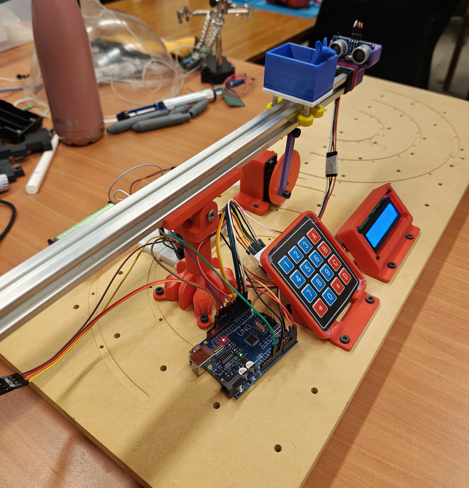
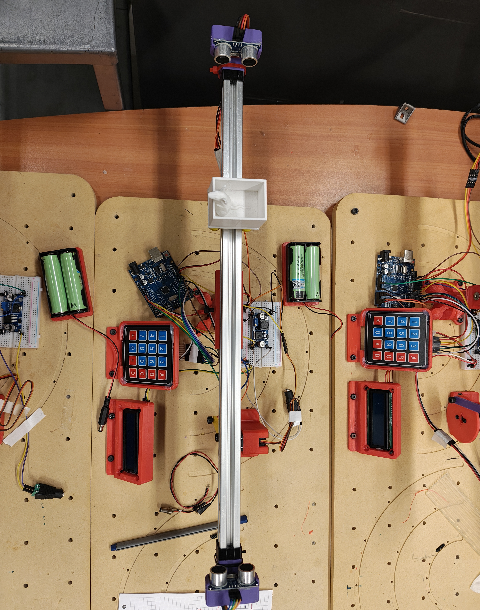
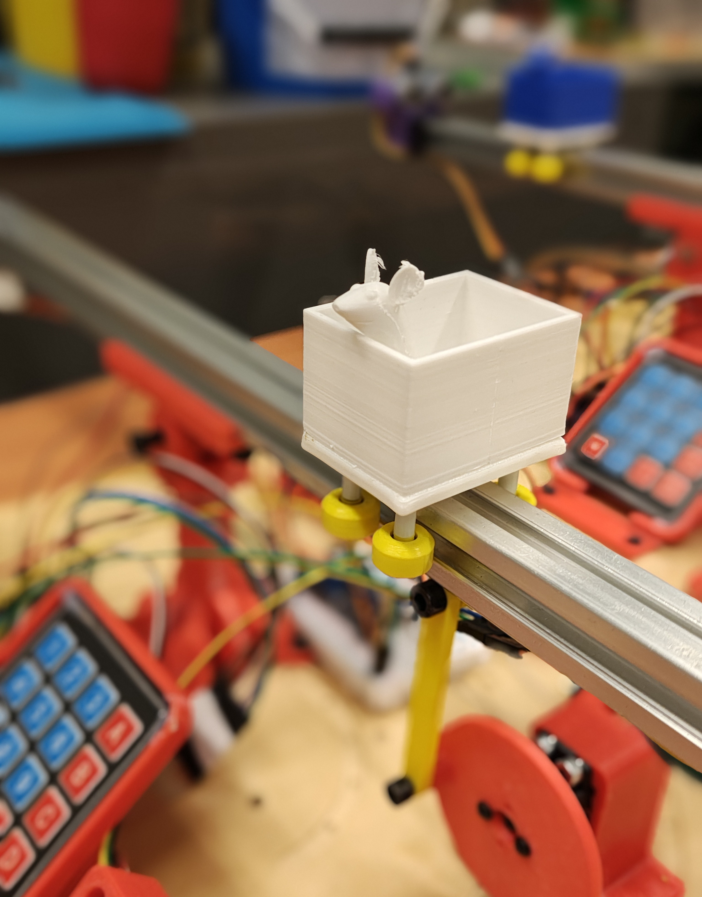

# ⚖️ Desafío 3: RatCraft - Sistema Ball & Beam

## ME4250 - Mecatrónica | Semestre 2026-1

  

<table align="center">
  <tr>
    <td align="center" width="50%">
      
       <i>Sistema encendido</i>
    </td>
    <td align="center" width="50%">
      
       <i>Vista Superior</i>
    </td>
  </tr>
  <tr>
    <td align="center" width="60%">
      
       <i>Detalle Interfaz de Usuario</i>
    </td>
    <td align="center" width="50%">
      
       <i>Detalle Minicart</i>
    </td>
  </tr>
</table>
Este repositorio contiene la documentación y los archivos fuente correspondientes al tercer y último desafío del curso. El objetivo principal es el diseño mecatrónico, la integración sensorial y el desarrollo de algoritmos de control automático para estabilizar una bola en una viga pivotante (Ball and Beam), gestionado mediante un microcontrolador Arduino.

El sistema fusiona las lecturas de dos sensores ultrasónicos en tiempo real para determinar la posición espacial de la bola, calcula el error frente a un setpoint central y acciona un servomotor de alto torque mediante un controlador **PID (Proporcional-Integral-Derivativo)**, logrando el equilibrio dinámico del sistema bajo perturbaciones.

## 📂 Estructura del Proyecto y Documentación

El proyecto está modularizado por áreas de ingeniería. Para revisar las instrucciones de montaje, el funcionamiento del algoritmo PID o el detalle de los circuitos de doble regulación, **por favor consulta el archivo `README.md` al interior de cada subcarpeta:**

* 📐 **[`CAD/`](CAD/README.md)** - Modelos 3D del mecanismo balancín, acoples de biela-manivela y soportes de la electrónica de control.
* 💻 **[`Código/`](Código/README.md)** - Firmware modularizado en C++ (`.ino`) incluyendo los programas de calibración angular, lectura sensorial "anti-fantasmas" y lazo de control PID con HMI.
* 📄 **[`Documentos/`](Documentos/README.md)** - Documentación formal del desafío, rúbricas y requerimientos de desempeño.
* ⚡ **[`Electrónica/`](Electrónica/README.md)** - Planos esquemáticos de la arquitectura de potencia dividida (5V Lógico / 6V Potencia) y mapas de interconexión.
* 📷 **[`Multimedia/`](Multimedia/README.md)** - Fotografías de la estructura y videos demostrativos de estabilización ante perturbaciones.

---

## 📋 Lista de Materiales (BOM)

Para la construcción de este prototipo, se utilizaron los siguientes componentes:

* **Microcontrolador:** 1x Arduino (Uno / Nano).
* **Control de Potencia:** 1x Servomotor de alto torque MG995.
* **Sensores:** 2x Sensores Ultrasónicos HC-SR04.
* **Interfaz de Usuario:** 1x Pantalla LCD 16x2 + 1x Módulo I2C + 1x Teclado Matricial 4x4.
* **Regulación de Energía (Doble Riel):** * 1x Convertidor Buck DC-DC Ajustable (Configurado a 6.0V para el motor).

* **Alimentación:** Pack de Baterías 18650 x2 (7.4V - 8.4V).
* **Control de Energía:** 1x Switch (interruptor) SPST.
* **Apoyo Mecánico:** Rodamientos, perfil de aluminio y fijaciones (ISO M3/M4/M5).
* **Elemento movil:** 1x Minicart (Carrito con ruedas hecho en impresión 3D).

---

## 📊 Criterios de Evaluación

* **Diagrama Esquemático:** Entregan un reporte con diagrama esquemático, código comentado y propuestas de mejora. (2 ptos)
* **Constante Proporcional (K):** Encuentran la constante proporcional del sistema. (1 pto)
* **Constante Integrativa (I):** Encuentran la constante integrativa del sistema (1 pto)
* **Constante Derivativa:** Encuentran la constante derivativa del sistema. (1 ptos)
* **Control Estable del Sistema:** Logran controlar el sistema de forma estable. Se considera estable la disminución del error al perturbar el sistema, alcanzando el equilibrio en el menor tiempo posible y que el sistema se quede totalmente quieto. (1 pto)

---

## 👨‍💻 Créditos y Evolución del Curso

Este desafío ha sido estructurado para integrar los conceptos de diseño mecánico, electrónica de potencia y control automático dictados durante el semestre.

* **Primeros diseñadores/fabricantes**: Francisco Cáceres, Fernando Navarrete.
* **Equipo Docente:** Harold Valenzuela, Fernando Navarrete, Valentina Abarca, Emilia Gutiérrez.

## 🎓 Acknowledgments / Agradecimientos

This project was made possible thanks to the academic support and specialized fabrication facilities provided by the **University of Chile**.

*Este proyecto fue posible gracias al apoyo académico y las instalaciones de fabricación especializadas provistas por la **Universidad de Chile**.*

| Institution / Institución | Contribution / Contribución |
| :---: | :--- |
|  | **LEMUR (Laboratorio de Ingeniería Mecatrónica y Robótica)** For providing the specialized engineering workspace, FDM 3D printers, and test instrumentation required for the belt validation. *(Por proveer el espacio de ingeniería, impresoras 3D FDM e instrumentación de prueba necesaria para la validación de la correa).* |
|  | **FABLAB U. de Chile** For their technical manufacturing advisory and access to computer-controlled machinery, specifically the Beambox Series Pro laser cutter. *(Por su asesoría técnica en manufactura y el uso de maquinaria CNC, principalmente la cortadora láser Beambox Series Pro).* |

---

*Open Source Educational Project - ME4250 Mecatrónica - (Semestre Otoño 2026-1)*