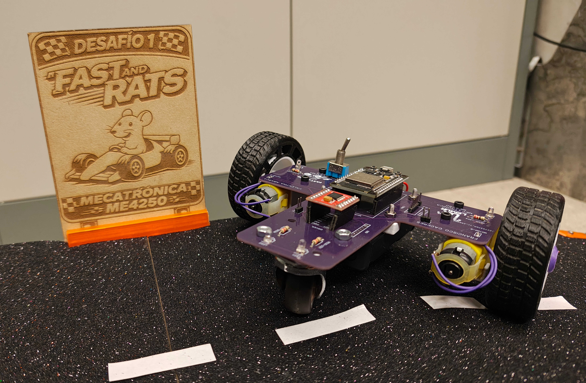
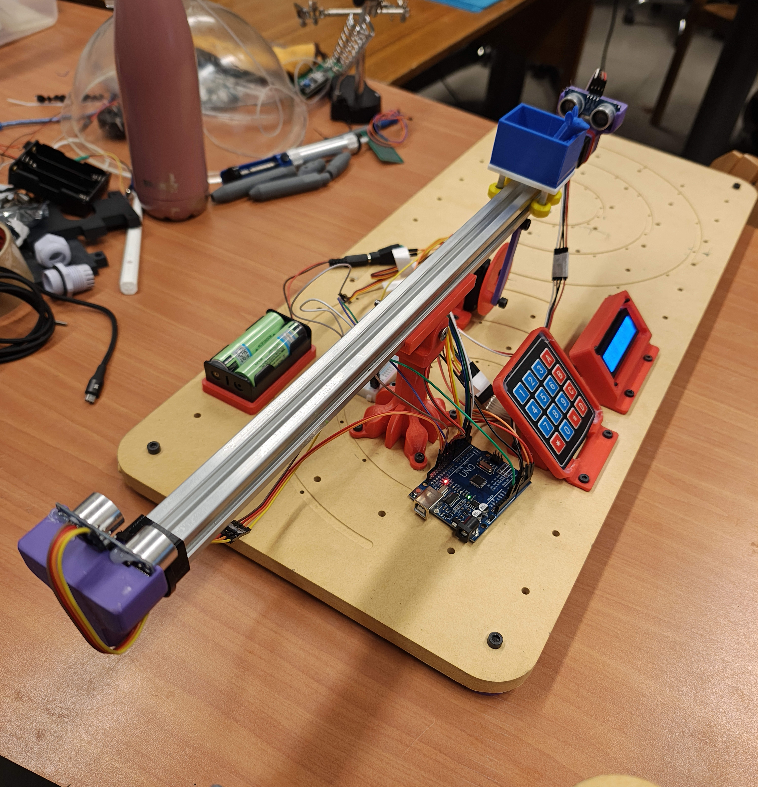

# ⚙️ Desafíos ME4250: Mecatrónica
## Semestre Otoño 2026-1

Bienvenidos al ecosistema de documentación técnica de los desafíos del curso **ME4250**. Este repositorio centraliza la investigación, el diseño mecatrónico, el desarrollo de firmware y la documentación técnica de los tres desafíos del semestre.

---

  
  
  

---

## 🚀 Desafíos del Semestre (2026-1)

### 🏎️ Desafío 1: El Ratmóvil 3era Edición
Unidad de actuadores electromecánicos, enfoque en motores DC, controladores y microcontroladores.
> [**Ver documentación completa del Desafío 1 →**](Desafío_1/README.md)

### 🏗️ Desafío 2: R.A.T Industries (V2)
Unidad de sensores, enfoque en calibración, recepción de datos y medición de variables.
> [**Ver documentación completa del Desafío 2 →**](Desafío_2/README.md)

### ⚖️ Desafío 3: RatCraft (v3) (Ball & Beam)
Unidad de control automático, enfoque en sistema de control PID y sistemas de retroalimentación de lazo cerrado.
> [**Ver documentación completa del Desafío 3 →**](Desafío_3/README.md)

---

## Historia de los Desafíos

_A inicios de 2024, los **Desafíos** nacen como una actividad contrarreloj donde los estudiantes deben resolver un problema con el fin de aplicar los conocimientos solicitados de la unidad en curso. Cada uno de los 3 desafíos abarca las unidades principales del curso de mecatrónica y permiten de una forma didáctiva e interactiva, desarrollar estrategias y aplicar su conocimiento de manera segura, práctica y visual._

_Por otro lado, el equipo docente motivado e inspirado, tras la buena recepción de la actividad, comienza a diseñar y fabricar los bien conocidos desafíos, los cuáles son probados y revisados previamente antes de entregarse a los estudiantes y del desarrollo de la actividad como tal. Estos sistemas se encuentran con varias complejidades o desperfectos que promueven la mejora continua y progresiva a través de los semestres de estos proyectos._

_En palabras del Cuerpo Docente de Mecatrónica: "Los desafíos, también son desafíos para nosotros"._

_Extendemos un agradecimiento a la Profesora Carolina Silva ([Github](https://github.com/blueCarolinne)), quién sembro la semilla, la cuál permitió desarrollar todas estas actividades (y sus respectivas iteraciones y mejoras). De la misma forma, se agradece a la dupla de auxiliares que comenzaron dando vida a estos proyectos y mejorándolos hasta su salida: Francisco Cáceres y Fernando Navarrete._

---

**Departamento de Ingeniería Mecánica | Universidad de Chile**